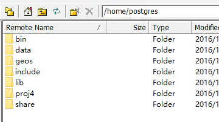
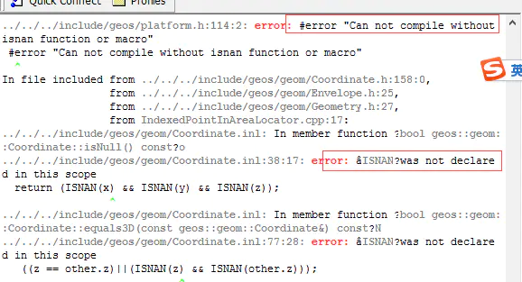
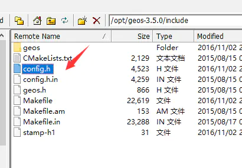
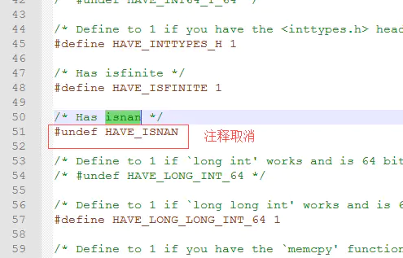

# CentOS 7源码安装PostGIS(包含SFCGAL,PgRouting) #

本文认为已安装PostgreSQL，安装步骤如 Centos7安装PostgreSQL，最好按照前文先把pg安装好，否则，在postgis,pgrouting安装时，指定pg的安装目录，直接抄路径应该不对，读者要指向自己的安装位置等。
注意，作者将Pg直接安装到了postgres用户下如下图：

Postgresql数据库安装全目录
本文将PostGIS及其外围用于三维的SFCGAL，用于网络分析的PgRouting安装都顺带上，安装步骤最好按照作者的说明安装，以免产生不可预测问题，毕竟坑我都趟过了。。。

一 安装gcc

    [root@VM_0_4_centos ~]#  yum install gcc
    [root@VM_0_4_centos ~]#  yum install gcc-c++   

二 编译GEOS

[root@VM_0_4_centos ~]# cd /opt
[root@VM_0_4_centos opt]# wget https://download.osgeo.org/geos/geos-3.7.0.tar.bz2
[root@VM_0_4_centos opt]# tar -jxvf geos-3.7.0.tar.bz2 
[root@VM_0_4_centos opt]# cd geos-3.7.0
[root@VM_0_4_centos geos-3.7.0]# ./configure --prefix=/usr/local/geos-3.7.0
[root@VM_0_4_centos geos-3.7.0]# make
[root@VM_0_4_centos geos-3.7.0]# make install   
 
如果有以下问题：

问题1：

    g++: command not found

于是直接yum先装上再说：

    yum install gcc-c++

问题2：

    error:#error "Can not compile without isnan function or macro"

报错截图.png

解决方法：
在geos解压的文件中，找到/include/config.h，编辑该文件，取消#undef HAVE_ISNAN的注释，保存退出，然后重新编译geos即可。

config.h文件目录位置

取消对HAVE_ISNAN的注释

三 编译Proj

    [root@VM_0_4_centos opt]#  wget http://download.osgeo.org/proj/proj-5.2.0.tar.gz
    [root@VM_0_4_centos opt]# tar -zxvf proj-5.2.0.tar.gz
    [root@VM_0_4_centos opt]# cd proj-5.2.0
    [root@VM_0_4_centos proj-5.2.0]# ./configure  --prefix=/usr/local/proj-5.2.0
    [root@VM_0_4_centos proj-5.2.0]# make
    [root@VM_0_4_centos proj-5.2.0]# make install   

四 编译GDAL

    [root@VM_0_4_centos opt]#  wget https://download.osgeo.org/gdal/2.3.2/gdal-2.3.2.tar.gz
    [root@VM_0_4_centos opt]# tar -zxvf gdal-2.3.2.tar.gz 
    [root@VM_0_4_centos opt]# cd gdal-2.3.2   
 
#编译时间比较久

    [root@VM_0_4_centos gdal-2.3.2]# ./configure  --prefix=/usr/local/gdal-2.3.2 --with-pg=/home/postgres/bin/pg_config
    [root@VM_0_4_centos gdal-2.3.2]# make
    [root@VM_0_4_centos gdal-2.3.2]# make install   

五 编译json-c

    [root@VM_0_4_centos opt]#  wget https://github.com/json-c/json-c/archive/json-c-0.13.1-20180305.tar.gz
    [root@VM_0_4_centos opt]# tar -zxvf json-c-0.13.1-20180305.tar.gz
    [root@VM_0_4_centos opt]# cd json-c-0.13.1-20180305
    [root@VM_0_4_centos json-c-0.13.1-20180305]# ./configure  --prefix=/usr/local/json-c-0.13.1
    [root@VM_0_4_centos json-c-0.13.1-20180305]# make
    [root@VM_0_4_centos json-c-0.13.1-20180305]# make install   

六 编译libxml2

    [root@VM_0_4_centos opt]#  wget https://github.com/GNOME/libxml2/archive/v2.9.7.tar.gz
    [root@VM_0_4_centos opt]# tar -zxvf libxml2-sources-2.9.7.tar.gz
    [root@VM_0_4_centos opt]# cd libxml2-2.9.7   
    [root@VM_0_4_centos libxml2-2.9.7]# ./configure  --prefix=/usr/local/libxml2-2.9.7
    [root@VM_0_4_centos libxml2-2.9.7]# make
    [root@VM_0_4_centos libxml2-2.9.7]# make install   

七 安装protobuf（可选安装，支持MVT等格式）

protobuf-c依赖protobuf，所以先安装protobuf。

    [root@VM_0_4_centos opt]#  wget https://github.com/protocolbuffers/protobuf/archive/v2.6.1.tar.gz
    [root@VM_0_4_centos opt]# tar -zxvf protobuf-2.6.1.tar.gz
    [root@VM_0_4_centos opt]# cd protobuf-2.6.1  
    [root@VM_0_4_centos protobuf-2.6.1]# ./configure  --prefix=/usr/local/protobuf-2.6.1
    [root@VM_0_4_centos protobuf-2.6.1]# make
    [root@VM_0_4_centos protobuf-2.6.1]# make install   
    
    #配置环境变量，增加下protobuf-2.6.1/bin
    [root@VM_0_4_centos protobuf-2.6.1]# vi /etc/profile
    export CMAKE_HOME=/usr/local/cmake-3.12.4
    export PROTOBUF_HOME=/usr/local/protobuf-2.6.1
    export PATH=$CMAKE_HOME/bin:$PROTOBUF_HOME/bin:$PATH
    #保存退出
    [root@VM_0_4_centos protobuf-2.6.1]# source /etc/profile
    #验证protobuf执行程序
    [root@VM_0_4_centos protobuf-2.6.1]# protoc --version
    libprotoc 2.6.1
    #安装成功

八 安装protobuf-c（可选安装，支持MVT等格式）

    [root@VM_0_4_centos opt]#  wget https://github.com/protobuf-c/protobuf-c/releases/download/v1.3.1/protobuf-c-1.3.1.tar.gz
    [root@VM_0_4_centos opt]# tar -zxvf protobuf-c-1.3.1.tar.gz
    [root@VM_0_4_centos opt]# cd protobuf-c-1.3.1  
    #导入protobuf的pkgconfig，否则"--No package 'protobuf' found"
    [root@VM_0_4_centos protobuf-c-1.3.1]# export PKG_CONFIG_PATH=/usr/local/protobuf-2.6.1/lib/pkgconfig
    [root@VM_0_4_centos protobuf-c-1.3.1]# ./configure  --prefix=/usr/local/protobuf-c-1.3.1
    [root@VM_0_4_centos protobuf-c-1.3.1]# make
    [root@VM_0_4_centos protobuf-c-1.3.1]# make install   
    
    #配置环境变量，增加下protobuf-c-1.3.1/bin
    [root@VM_0_4_centos protobuf-2.6.1]# vi /etc/profile
    export CMAKE_HOME=/usr/local/cmake-3.12.4
    export PROTOBUF_HOME=/usr/local/protobuf-2.6.1
    export PATH=$CMAKE_HOME/bin:$PROTOBUF_HOME/bin:/usr/local/protobuf-c-1.3.1/bin:$PATH
    #保存退出
    [root@VM_0_4_centos protobuf-2.6.1]# source /etc/profile

九 安装cgal（可选）

sfcgal,pgrouting都依赖boost,cgal，作者实际掉坑了很多次这个东西，boost，cgal安装编译都成功，就是无法编译sfcgal，或者编译好了pgrouting却无法使用，经过一个月的不停尝试，找出问题就是boost,cgal这两个坑爹东西的问题，只要记住一点，只安装到默认路径，不要指定路径，否则坑死活不了。

    #boost
    [root@VM_0_4_centos opt]#  yum install boost-devel
    # 安装指定版本cgal-4.13
    [root@VM_0_4_centos opt]# wget https://github.com/CGAL/cgal/archive/releases/CGAL-4.13.tar.gz
    [root@VM_0_4_centos opt]# tar -zxvf CGAL-4.13.tar.gz   
    [root@VM_0_4_centos opt]# cd CGAL-4.13  
    [root@VM_0_4_centos CGAL-4.13]#mkdir build & cd build 
    #cmake不要指定安装路径
    [root@VM_0_4_centos build]# cmake ..
    [root@VM_0_4_centos build]# make
    [root@VM_0_4_centos build]# make install   

安装sfcgal（可选安装，支持三维数据分析）

    [root@VM_0_4_centos opt]#  wget https://github.com/Oslandia/SFCGAL/archive/v1.3.6.tar.gz
    [root@VM_0_4_centos opt]# tar -zxvf v1.3.6.tar.gz   
    [root@VM_0_4_centos opt]# cd SFCGAL-1.3.6  
    [root@VM_0_4_centos SFCGAL-1.3.6]#mkdir build & cd build 
    [root@VM_0_4_centos build]# cmake -DCMAKE_INSTALL_PREFIX=/usr/local/sfcgal-1.3.6 ..
    [root@VM_0_4_centos build]# make
    [root@VM_0_4_centos build]# make install   

十 安装PostGIS

10.1 配置ld.so.conf

    [root@VM_0_4_centos opt]# vim /etc/ld.so.conf
    #编辑内容如下
    include ld.so.conf.d/*.conf
    /home/postgres/lib
    /usr/local/proj-5.2.0/lib
    /usr/local/gdal-2.3.2/lib
    /usr/local/geos-3.7.0/lib
    /usr/local//sfcgal-1.3.6/lib64
    /usr/local/json-c-0.13.1/lib
    /usr/local/libxml2-2.9.7/lib
    /usr/local/protobuf-2.6.1/lib
    /usr/local/protobuf-c-1.3.1/lib
    #编辑完成后wq!保存退出
    #保存配置，重启生效
    [root@VM_0_4_centos opt]# ldconfig -v 

10.2 编译安装PostGIS

    [root@VM_0_4_centos opt]# wget http://download.osgeo.org/postgis/source/postgis-2.5.0.tar.gz
    [root@VM_0_4_centos opt]# tar -zxvf postgis-2.5.0.tar.gz
    [root@VM_0_4_centos opt]# cd postgis-2.5.0 
    #根据安装不同的要求，选择任意一个configure
    #基本安装，不带protobuf,sfcgal
    [root@VM_0_4_centos postgis-2.5.0]# ./configure --prefix=/home/postgres --with-gdalconfig=/usr/local/gdal-2.3.2/bin/gdal-config --with-pgconfig=/home/postgres/bin/pg_config --with-geosconfig=/usr/local/geos-3.7.0/bin/geos-config --with-projdir=/usr/local/proj-5.2.0 --with-xml2config=/usr/local/libxml2-2.9.7/bin/xml2-config --with-jsondir=/usr/local/json-c-0.13.1
    #带protobuf安装，支持mvt
    [root@VM_0_4_centos postgis-2.5.0]# ./configure --prefix=/home/postgres --with-gdalconfig=/usr/local/gdal-2.3.2/bin/gdal-config --with-pgconfig=/home/postgres/bin/pg_config --with-geosconfig=/usr/local/geos-3.7.0/bin/geos-config --with-projdir=/usr/local/proj-5.2.0 --with-xml2config=/usr/local/libxml2-2.9.7/bin/xml2-config --with-jsondir=/usr/local/json-c-0.13.1 --with-protobufdir=/usr/local/protobuf-c-1.3.1
    # 带protobuf,sfcgal安装
    [root@VM_0_4_centos postgis-2.5.0]# ./configure --prefix=/home/postgres --with-gdalconfig=/usr/local/gdal-2.3.2/bin/gdal-config --with-pgconfig=/home/postgres/bin/pg_config --with-geosconfig=/usr/local/geos-3.7.0/bin/geos-config --with-projdir=/usr/local/proj-5.2.0 --with-xml2config=/usr/local/libxml2-2.9.7/bin/xml2-config --with-jsondir=/usr/local/json-c-0.13.1 --with-protobufdir=/usr/local/protobuf-c-1.3.1 --with-sfcgal=/usr/local/sfcgal-1.3.6/bin/sfcgal-config
    
    [root@VM_0_4_centos postgis-2.5.0]#  make
    [root@VM_0_4_centos postgis-2.5.0]# make install

10.3 创建postgis扩展

    [root@VM_0_4_centos opt]# su - postgres
    [postgres@ssss~]$ psql
    psql (11.0)
    Type "help" for help.
    
    postgres=# create database gistest;
    CREATE DATABASE
    postgres=# \c gistest
    You are now connected to database "gistest" as user "postgres".
    gistest=# create extension postgis;
    CREATE EXTENSION
    #如果安装了sfcgal，创建扩展测试下
    gistest=# create extension postgis_sfcgal;
    CREATE EXTENSION

十一 安装PgRouting（网络分析）

依赖boost,cgal，如果没有安装，依照前文，安装下boost,cgal

    [root@VM_0_4_centos opt]# wget https://github.com/pgRouting/pgrouting/releases/download/v2.6.1/pgrouting-2.6.1.tar.gz
    [root@VM_0_4_centos opt]# tar -zxvf pgrouting-2.6.1.tar.gz   
    [root@VM_0_4_centos opt]# cd pgrouting-2.6.1  
    [root@VM_0_4_centos pgrouting-2.6.1]#mkdir build & cd build 
    #引入postgres的环境变量
    [root@VM_0_4_centos build]#  source /home/postgres/.bashrc
    [root@VM_0_4_centos build]# cmake ..
    [root@VM_0_4_centos build]# make
    [root@VM_0_4_centos build]# make install  
 
如果不引入pg的环境变量，找不到pg库安装位置的话，cmake会报错如下：

    -- PostgreSQL not found.
    CMake Error at CMakeLists.txt:294 (message):
       Please check your PostgreSQL installation.

验证安装：

    [root@VM_0_4_centos opt]# su - postgres
    [postgres@ssss~]$ psql -d gistest
    psql (11.0)
    Type "help" for help.
    
    
    gistest=# create extension pgrouting;
    CREATE EXTENSION

十二 安装的问题

最容易产生问题的是sfcgal，pgrouting安装，笔者大概稍微整理下，方便遇到同样问题的朋友能搜索链接到此。

    libpgrouting-2.6.so: undefined symbol
    test=# create extension pgrouting;
    ERROR: could not load library "/home/postgres/lib/libpgrouting-2.6.so": /home/postgres/lib/libpgrouting-2.6.so: undefined symbol: ZN4CGAL18postcondition_failEPKcS1_iS1

问题原因：boost,cgal，pgrouting也许都安装正确了，就是不能用，神奇不神奇？作者的原因就是安装了一堆东西，gcc，boost安装了两个版本之类的，我先卸载自己安装的gcc-5.4.0,boost-1.65.0，全部用yum install重新安装了gcc,boost见前文。另外一个坑就是cgal安装指定了路径，重新安装到默认的include,lib下，不要自己指定路径了！！！

sfcgal编译问题

注意看github上sfcgal对应的cgal版本，有版本对应关系。还有一点，严格按照作者的做法，安装正确版本的 cgal到默认的安装目录，避免此问题。

postgis with sfcgal make error

    [root@VM_0_4_centos postgis-2.5.0]# ./configure --prefix=/home/postgres --with-gdalconfig=/usr/local/gdal-2.3.2/bin/gdal-config --with-pgconfig=/home/postgres/bin/pg_config --with-geosconfig=/usr/local/geos-3.7.0/bin/geos-config --with-projdir=/usr/local/proj-5.2.0 --with-xml2config=/usr/local/libxml2-2.9.7/bin/xml2-config --with-jsondir=/usr/local/json-c-0.13.1 --with-protobufdir=/usr/local/protobuf-c-1.3.1 --with-sfcgal=/usr/local/sfcgal-1.3.6/bin/sfcgal-config
    ` -------------- Dependencies --------------
    GEOS config: /usr/local/geos-3.7.0/bin/geos-config
    GEOS version: 3.7.0
    GDAL config: /usr/local/gdal-2.3.2/bin/gdal-config
    GDAL version: 2.3.2
    SFCGAL config: /usr/local/sfcgal/bin/sfcgal-config
    SFCGAL version: 1.3.5
    PostgreSQL config: /home/postgres/bin/pg_config
    PostgreSQL version: PostgreSQL 11.0
    PROJ4 version: 52
    Libxml2 config: /usr/local/libxml2-2.9.7/bin/xml2-config
    Libxml2 version: 2.9.7
    JSON-C support: yes
    protobuf-c support: yes
    PCRE support: yes
    Perl: /usr/bin/perl
    
    --------------- Extensions ---------------
    PostGIS Raster: enabled
    PostGIS Topology: enabled
    SFCGAL support: enabled
    Address Standardizer support: enabled
    [root@VM_0_4_centos postgis-2.5.0]# make 
    .....
    /usr/local//sfcgal/lib64/libSFCGAL.so.1: undefined reference to boost::serialization::void_upcast(boost::serialization::extended_type_info const&, boost::serialization::extended_type_info const&, void const*)' 
    .....

配置验证都正确，就是make报错，请注意万恶的boost又出现了，哭不哭。。。
解决方案，全部用yum install重新安装了gcc,boost见前文。另外一个坑就是cgal安装指定了路径，重新安装到默认的include,lib下，不要自己指定路径了！！！

一个多月有空就编译，什么都正确，就是不好使，一度怀疑人生。。。万恶的boost，cgal问题！！！

作者：遥想公瑾当年

链接：https://www.jianshu.com/p/e08dbc60a3b2

来源：简书

著作权归作者所有。商业转载请联系作者获得授权，非商业转载请注明出处。