# centos 7安装 postgres 10 和 postgis #

在mysql被收购之后，大家发现了另一款开源的数据库，postgresql，虽然centos自带版本9.2也可以用，但是最近的几次升级支持了更多更新的内容，比如，PostgreSQL有一个MySQL无法比拟的优势，那就是PostGIS，PostGIS可以完美支持空间数据存储和空间分析；从PostgreSQL9.3起就内置了JSON数据类型，而9.4又开始支持JSONB，这标志着PostgreSQL实际上已经是一个关系型数据库和NoSQL数据库的结合体了、虽然postgresql是一个关系型数据库，但是近几次更新PostgreSQL的NoSQL性能有益到甚至超过了MongoDB。

系统自带版本9.2略低，近几次升级功能较多，本次安装最新版本。

## 第一部分：安装POSTGRESQL ##

一、更新源

地址：`https://yum.postgresql.org/repopackages.php`

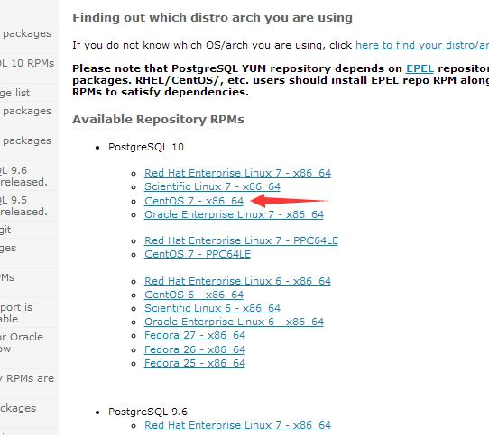

这里我选择centos7-x86 64 右键 复制链接。

在centos系统中执行

 

    yum install https://download.postgresql.org/pub/repos/yum/10/redhat/rhel-7-x86_64/pgdg-centos10-10-2.noarch.rpm -y
               

二、安装postgresql

先查看postgresql源

    yum list | grep postgresql

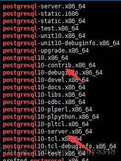


我们需要安装的是这两个。postgresql10-contrib postgresql10-server

    yum install postgresql10-contrib postgresql10-server -y  

三、初始化数据库

Postgresql安装目录是/usr/pgsql-10,而Postgresql的数据目录是/var/lib/pgsql/版本号/data目录

在这里，如果在装系统开始分配var空间足够大则可以继续，如果分配var空间不够，我们需要更改数据目录，在这里，我们假设var空间足够大。直接开始初始化。

    /usr/pgsql-10/bin/postgresql-10-setup initdb  

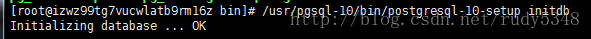
 

显示这个代表初始化成功

 

四、启动数据库并设置开机启动

    sudo systemctl start postgresql-10
    sudo systemctl enable postgresql-10.service

五、登录postgresql并设置密码

postgresql在安装时默认添加用户postgres

命令行下输入

```
     #su - postgres

     #psql 
```

进入数据库

样子长这样

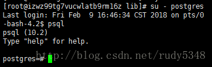

我们来设置密码：

 

    ALTER USER postgres WITH PASSWORD 'New Password';


注意这里的 ; 一定不能漏掉

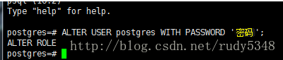


 

退出：

```
         \q  

         exit
```
 

备注其他：列出所有库\l  列出所有用户\du 列出库下所有表\d

 

六、默认情况下postgresql是不用密码方式登录，不支持远程登录的。我们需要修改配置文件

 

    vi /var/lib/pgsql/10/data/pg_hba.conf

原本长成这样

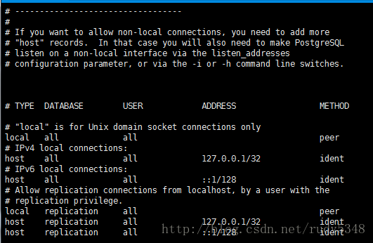

我们需要改成（METHOD改成MD5 表示密码方式登录）

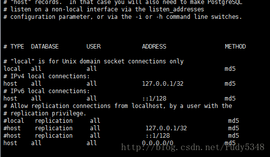

注意，最后一行 host all all  0.0.0.0/0   md5 要加上，否则不能访问

如果为了防止忘记密码，我们本地命令行方式需要能强制改密码，可以把local 后的method改成trust

保存退出

我们改远程访问

    vi /var/lib/pgsql/10/data/postgresql.conf 

往下拉我们会看到

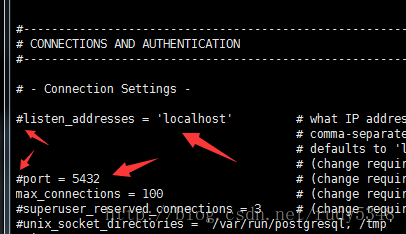

需要改成

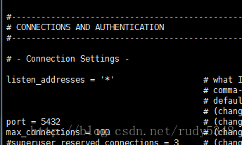

重启postgresql

    systemctl restart postgresql-10 
 

七、登录postgresql

postgresql在安装时默认添加用户 postgres

输入

    su - postgres  
    psql  

进入数据库

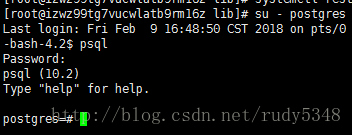


 

此时已经可以进行验证密码

八、远程连接数据库

我们用pgadmin进行验证连接

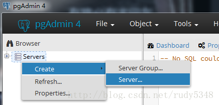

输入相关信息

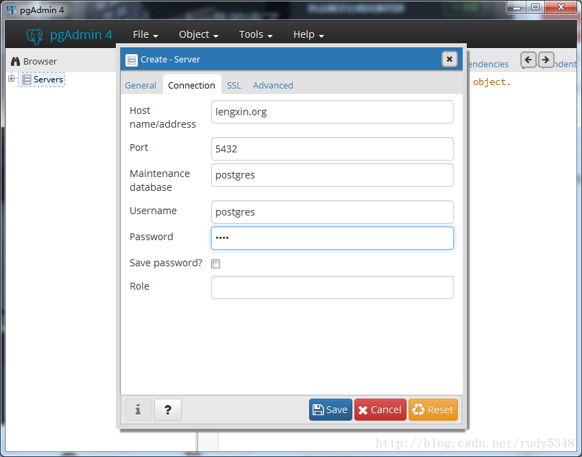

此时我们可以看到相关数据了

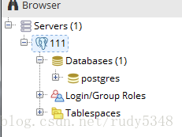

navicat 是更好的一款数据库管理软件

九、测试创建数据库及创建用户

因为postgres属于superuser，我们需要创建部分低权限用户

创建数据库


`CREATE DATABASE testdb; ` 


创建用户

 

    CREATE USER testuser CREATEDB LOGIN PASSWORD 'testpassword';  

将testdb所有权限赋给用户testuser

 

    GRANT ALL ON DATABASE testdb TO testuser;  

样子：

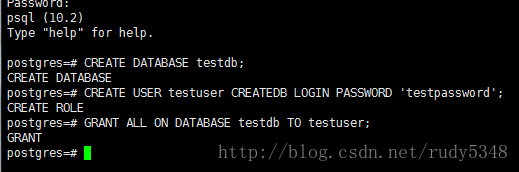

查看现有数据库及用户

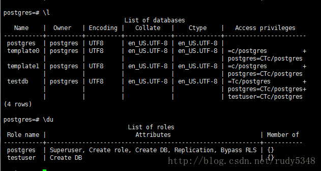

十、删除数据库及测试用户

删除数据库


    drop database testdb;  
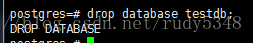

删除用户

    drop role testuser;  
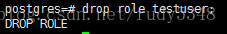

验证：

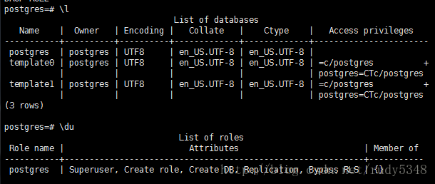

 

至此，我们已经完成基础的东西了。。至于其他，自己发挥吧。 

POSTGRESQL11的安装与此相同

 

## 第二部分：安装POSTGIS ##
 

1.先安装几个工具包

    yum install wget net-tools epel-release -y

然后安装postgis

    yum install postgis24_10 postgis24_10-client -y

安装拓展工具

    yum install ogr_fdw10 -y
    yum install pgrouting_10 -y

如果是pg是11版本，这里的10改成11

2.创建数据库

    CREATE DATABASE mydb OWNER postgres;

切换新创建的database

    \c mydb

安装PostGis扩展（如果用的阿里云 rds,已经安装好了postgis,只需要执行下面的SQL启用postgis即可）

    postgis=# CREATE EXTENSION postgis;
    postgis=# CREATE EXTENSION postgis_topology;

然后可以验证是否安装成功

    SELECT postgis_full_version();
 
————————————————

版权声明：本文为CSDN博主「soband_xiang」的原创文章，遵循CC 4.0 BY-SA版权协议，转载请附上原文出处链接及本声明。

原文链接：https://blog.csdn.net/soband_xiang/article/details/80800237