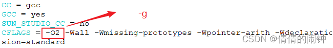
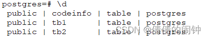

# PostgreSQL编译安装

1、下载源码解压之后，对源码进行configure，安装到
```
yum install readline
yum install readline readline-devel
yum install zlib
yum install zlib-devel
tar xvf postgresql-9.2.24.tar.gz
cd postgresql-9.2.24/
./configure --prefix=/usr/local/postgresql --enable-debug
```
2、修改Makefile.global

```
vim src/Makefile.global
```



3、编译和安装

```
make -j32 && make install
```
4、创建数据库数据存放路径和添加用户
```
useradd postgres
mkdir -p /data/postgresql
chown postgres /data/postgresql
chgrp postgres /data/postgresql
chown -R postgres:postgres /usr/local/postgresql/
```
备注：不设置postgresql在启动的时候会报logfile错
```
mkdir /home/postgres
chown postgres /home/postgres
chgrp postgres /home/postgres
```
5、切换用户和初始化数据库
```
su - postgres
$ /usr/local/postgresql/bin/initdb -D /data/postgresql
The files belonging to this database system will be owned by user "postgres".
This user must also own the server process.
The database cluster will be initialized with locale "en_US.UTF-8".
The default database encoding has accordingly been set to "UTF8".
The default text search configuration will be set to "english".
......
Success. You can now start the database server using:
    /usr/local/postgresql/bin/postgres -D /data/postgresql
or
    /usr/local/postgresql/bin/pg_ctl -D /data/postgresql -l logfile start
```
6、启动和停止数据库
启动数据库：
```
/usr/local/postgresql/bin/pg_ctl -D /data/postgresql -l logfile start
```
停止数据库：
```
/usr/local/postgresql/bin/pg_ctl -D /data/postgresql stop -m fast
```
7、登录数据库
```
/usr/local/postgresql/bin/psql postgres
```
8、设置配置文件
```
vim /data/postgresql/postgresql.conf
debug_print_parse = on
debug_print_rewritten = on
debug_print_plan = on
```
查看配置：
```
postgres=# select pg_reload_conf();
postgres=# show debug_print_parse;
 debug_print_parse
-------------------
 on
(1 row)
```
9、导出或导入数据库文件
导出：
```
copy tb1 to '/home/postgres/test' with (delimiter '|');
```
导入：
```
copy tb1 from '/home/postgres/test' with (delimiter '|');
```
10、查看数据库
```
postgres=# \l
 postgres  | postgres | UTF8     | en_US.UTF-8 | en_US.UTF-8 | 
 template0 | postgres | UTF8     | en_US.UTF-8 | en_US.UTF-8 | =c/postgres          +
           |          |          |             |             | postgres=CTc/postgres
 template1 | postgres | UTF8     | en_US.UTF-8 | en_US.UTF-8 | =c/postgres          +
           |          |          |             |             | postgres=CTc/postgres
```
11、切换数据库
```
postgres=# \c postgres 
You are now connected to database "postgres" as user "postgres".
```
12、查看数据库里面的表



13、快速清空表数据
```
postgres=# truncate table tb1;
TRUNCATE TABLE
```
14、查看数据库oid
```
postgres=# select datname,oid from pg_database where datname='postgres';
 postgres | 12057
```
15、查看表的oid
```
postgres=# select relname,oid from pg_class where relname='codestat';
 codestat | 16394
```
16、开启pageinspect功能

找到pageinspect目录：
```
[root@bat ~]# find / -name pageinspect -print
/root/postgresql-9.2.24/contrib/pageinspect
```
进入目录执行编译：
```
[root@bat ~]# cd /root/postgresql-9.2.24/contrib/pageinspect
[root@bat pageinspect]# make
...
[root@bat pageinspect]# make install
/usr/bin/mkdir -p '/usr/local/postgresql/lib'
/usr/bin/mkdir -p '/usr/local/postgresql/share/extension'
/usr/bin/mkdir -p '/usr/local/postgresql/share/extension'
/bin/sh ../../config/install-sh -c -m 755  pageinspect.so '/usr/local/postgresql/lib/pageinspect.so'
/bin/sh ../../config/install-sh -c -m 644 ./pageinspect.control '/usr/local/postgresql/share/extension/'
/bin/sh ../../config/install-sh -c -m 644 ./pageinspect--1.0.sql ./pageinspect--unpackaged--1.0.sql  '/usr/local/postgresql/share/extension/'
```
修改权限：
```
cd /usr/local/postgresql/lib/
chown -R postgres:postgres pageinspect.so
cd /usr/local/postgresql/share/extension
[root@bat extension]# ll -i
total 24
1839735 -rw-r--r-- 1 root     root     2339 Dec  6 15:10 pageinspect--1.0.sql
1839734 -rw-r--r-- 1 root     root      173 Dec  6 15:10 pageinspect.control
1839736 -rw-r--r-- 1 root     root     1116 Dec  6 15:10 pageinspect--unpackaged--1.0.sql
1839730 -rw-r--r-- 1 postgres postgres  332 Nov 28 10:57 plpgsql--1.0.sql
1839729 -rw-r--r-- 1 postgres postgres  179 Nov 28 10:57 plpgsql.control
1839731 -rw-r--r-- 1 postgres postgres  381 Nov 28 10:57 plpgsql--unpackaged--1.0.sql
chown -R postgres:postgres pageinspect--1.0.sql pageinspect.control pageinspect--unpackaged--1.0.sql
```
登录sql中执行下面sql命令：
```
postgres=# CREATE EXTENSION pageinspect;
CREATE EXTENSION
```
————————————————

版权声明：本文为CSDN博主「倩倩的闹钟」的原创文章，遵循CC 4.0 BY-SA版权协议，转载请附上原文出处链接及本声明。

原文链接：https://blog.csdn.net/yuanyuanstudent/article/details/128239127