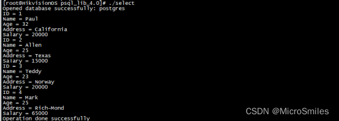

# psql数据库学习与使用 #

## 0 psql简介 ##

在数据库术语里，PostgreSQL使用一种客户端/服务器的模型。一次PostgreSQL会话由下列相关的进程（程序）组成：

1.一个服务器进程，它管理数据库文件、接受来自客户端应用与数据库的联接并且代表客户端在数据库上执行操作。 该数据库服务器程序叫做postgres。

2.那些需要执行数据库操作的用户的客户端应用。

PostgreSQL服务器可以处理来自客户端的多个并发请求。 因此，它为每个连接启动（“forks”）一个新的进程

## 1.psql安装 ##

Ubuntu安装：

安装PostgreSQL客户端。

	sudo apt-get install postgresql-client

安装PostgreSQL服务器

	sudo apt-get install postgresql

正常情况下，安装完成后，PostgreSQL服务器会自动在本机的5432端口开启。

## 2.Centos安装： ##

[PostgreSQL: Linux downloads (Red Hat family) ](https://www.postgresql.org/download/linux/redhat/)

默认会创建名为"postgres"的Linux用户和数据库账号和数据库名

**2.1 基础命令行**

**2.1.1 登录数据库**

使用psql命令登录数据库的命令为：

	psql -U dbuser -d exampledb -h 127.0.0.1 -p 5432

上面命令的参数含义如下：-U指定用户，-d指定数据库，-h指定服务器，-p指定端口。

输入上面命令以后，系统会提示输入dbuser用户的密码。


 账户:psql  -U postgres   -d  postgres


**2.1.2 添加新用户和新数据库**

步骤1：设定密码postgres密码

	\password postgres

步骤2：创建数据库用户dbuser（刚才创建的是Linux系统用户），并设置密码

	CREATE USER dbuser WITH PASSWORD 'password'; 


 步骤3：创建用户数据库，这里为exampledb，并指定所有者为dbuser。

	CREATE DATABASE exampledb OWNER dbuser;


步骤4：将exampledb数据库的所有权限都赋予dbuser，否则dbuser只能登录控制台，没有任何数据库操作权限。

	GRANT ALL PRIVILEGES ON DATABASE exampledb to dbuser;

步骤5：退出

	\q

**2.2控制台命令**


**2.3 数据库操作**


**2.4数据库导入导出**

展示没有使用到

**2.5问题解决**


解决：
步骤1：#将文件Database administrative 下列中的peer改为trust

vi  /etc/postgresql/14/main/pg_hba.conf


步骤2：sudo service postgresql restart


## 3.API使用 ##

可以参考大佬博文：

[C/C++连接PostgreSQL数据库 -PostgreSQL教程™](https://www.yiibai.com/postgresql/postgresql_c_cpp.html)

[PostgreSQL连接C/C++接口实例](https://www.yiibai.com/html/postgresql/2013/080894.html)

3.0  libpqxx编译

```
wget http://pqxx.org/download/software/libpqxx/libpqxx-4.0.1.tar.gz
tar -xzf libpqxx-4.0.1.tar.gz
cd libpqxx-4.0.1
./configure --prefix=/usr/local --enable-shared
make && make install
```

Centos编译问题：

[PostgreSQL - pg_config -bash: pg_config: command not found](https://stackoverflow.com/questions/4293111/postgresql-pg-config-bash-pg-config-command-not-found)

解决：

	yum install postgresql-devel

**3.1 常用API操作**


**3.2 连接示例**

连接数据库

示例：

```
#include <iostream>
#include <pqxx/pqxx>
 
using namespace std;
using namespace pqxx;
 
int main(int argc, char* argv[])
{
   try{
      connection C("dbname=postgres user=postgres password=Hik123456 \
      hostaddr=127.0.0.1 port=7017");
      if (C.is_open()) {
         cout << "Opened database successfully: " << C.dbname() << endl;
      } else {
         cout << "Can't open database" << endl;
         return 1;
      }
 
      C.disconnect ();
   }catch (const std::exception &e){
      cerr << e.what() << std::endl;
      return 1;
   }
}
```

运行结果：


**3.3 创建表示例**

创建的数据库中创建一个表

运行示例：

```
#include <iostream>
#include <pqxx/pqxx>
 
using namespace std;
using namespace pqxx;
 
int main(int argc, char* argv[])
{
   char * sql;
   try{
      connection C("dbname=postgres user=postgres password=Hik123456 \
      hostaddr=127.0.0.1 port=7017");
 
      if (C.is_open()) {
         cout << "Opened database successfully: " << C.dbname() << endl;
      } else {
         cout << "Can't open database" << endl;
         return 1;
      }
      /* Create SQL statement */
      sql = "CREATE TABLE COMPANY("  \
      "ID INT PRIMARY KEY     NOT NULL," \
      "NAME           TEXT    NOT NULL," \
      "AGE            INT     NOT NULL," \
      "ADDRESS        CHAR(50)," \
      "SALARY         REAL );";
 
      /* Create a transactional object. */
      work W(C);
      /* Execute SQL query */
      W.exec( sql );
      W.commit();
      cout << "Table created successfully" << endl;
      C.disconnect ();
   }catch (const std::exception &e){
      cerr << e.what() << std::endl;
      return 1;
   }
 
   return 0;
}
```

运行结果：


服务端：


**3.4 增加示例**

创建的数据库中向company表内插入项

示例：

```
#include <iostream>
#include <pqxx/pqxx>
 
using namespace std;
using namespace pqxx;
 
 
int main(int argc, char* argv[])
{
   char * sql;
   try{
    connection C("dbname=postgres user=postgres password=Hik123456 \
      hostaddr=127.0.0.1 port=7017");
 
      if (C.is_open()) {
         cout << "Opened database successfully: " << C.dbname() << endl;
      } else {
         cout << "Can't open database" << endl;
         return 1;
      }
 
      /* Create SQL statement */
 
      sql = "INSERT INTO COMPANY (ID,NAME,AGE,ADDRESS,SALARY) "  \
      "VALUES (1, 'Paul', 32, 'California', 20000.00 ); " \
      "INSERT INTO COMPANY (ID,NAME,AGE,ADDRESS,SALARY) "  \
      "VALUES (2, 'Allen', 25, 'Texas', 15000.00 ); "     \
      "INSERT INTO COMPANY (ID,NAME,AGE,ADDRESS,SALARY)" \
      "VALUES (3, 'Teddy', 23, 'Norway', 20000.00 );" \
      "INSERT INTO COMPANY (ID,NAME,AGE,ADDRESS,SALARY)" \
      "VALUES (4, 'Mark', 25, 'Rich-Mond ', 65000.00 );";
 
      /* Create a transactional object. */
      work W(C);
      /* Execute SQL query */
 
      W.exec( sql );
      W.commit();
      cout << "Records created successfully" << endl;
      C.disconnect ();
   }catch (const std::exception &e){
      cerr << e.what() << std::endl;
      return 1;
   }
 
   return 0;
 
}
```

运行结果：


数据库：


**3.5 选择示例**

查询创建的数据库中表中内容

示例：

```
#include <iostream>
#include <pqxx/pqxx>
 
using namespace std;
using namespace pqxx;
 
int main(int argc, char* argv[])
{
   char * sql;
   try{
      connection C("dbname=postgres user=postgres password=Hik123456 \
      hostaddr=127.0.0.1 port=7017");
 
      if (C.is_open()) {
         cout << "Opened database successfully: " << C.dbname() << endl;
      } else {
         cout << "Can't open database" << endl;
         return 1;
      }
 
      /* Create SQL statement */
      sql = "SELECT * from COMPANY";
      /* Create a non-transactional object. */
      nontransaction N(C);
 
      /* Execute SQL query */
      result R( N.exec( sql ));
      /* List down all the records */
      for (result::const_iterator c = R.begin(); c != R.end(); ++c) {
         cout << "ID = " << c[0].as<int>() << endl;
         cout << "Name = " << c[1].as<string>() << endl;
         cout << "Age = " << c[2].as<int>() << endl;
         cout << "Address = " << c[3].as<string>() << endl;
         cout << "Salary = " << c[4].as<float>() << endl;
      }
 
      cout << "Operation done successfully" << endl;
      C.disconnect ();
   }catch (const std::exception &e){
      cerr << e.what() << std::endl;
      return 1;
   }
 
   return 0;
 
}
```

运行结果：



**3.6 修改示例**

创建的数据库中修改一个表

示例：

```
#include <iostream>
#include <pqxx/pqxx>
 
using namespace std;
using namespace pqxx;
 
int main(int argc, char* argv[])
{
   char * sql;
   try{
      connection C("dbname=postgres user=postgres password=Hik123456 \
      hostaddr=127.0.0.1 port=7017");
 
      if (C.is_open()) {
         cout << "Opened database successfully: " << C.dbname() << endl;
      } else {
         cout << "Can't open database" << endl;
         return 1;
      }
 
      /* Create a transactional object. */
      work W(C);
 
      /* Create  SQL UPDATE statement */
      sql = "UPDATE COMPANY set SALARY = 25000.00 where ID=1";
 
      /* Execute SQL query */
      W.exec( sql );
      W.commit();
      cout << "Records updated successfully" << endl;
 
      /* Create SQL SELECT statement */
      sql = "SELECT * from COMPANY";
 
      /* Create a non-transactional object. */
      nontransaction N(C);
 
      /* Execute SQL query */
      result R( N.exec( sql ));
 
      /* List down all the records */
      for (result::const_iterator c = R.begin(); c != R.end(); ++c) {
         cout << "ID = " << c[0].as<int>() << endl;
         cout << "Name = " << c[1].as<string>() << endl;
         cout << "Age = " << c[2].as<int>() << endl;
         cout << "Address = " << c[3].as<string>() << endl;
         cout << "Salary = " << c[4].as<float>() << endl;
      }
 
      cout << "Operation done successfully" << endl;
      C.disconnect ();
   }catch (const std::exception &e){
      cerr << e.what() << std::endl;
      return 1;
   }
 
   return 0;
}
```

运行结果：


数据库：


**3.7 删除示例**

创建的数据库中删除一个表中的条项

示例：

```
#include <iostream>
#include <pqxx/pqxx>
using namespace std;
using namespace pqxx;
 
int main(int argc, char* argv[])
{
 
   char * sql;
   try{
      connection C("dbname=postgres user=postgres password=Hik123456 \
      hostaddr=127.0.0.1 port=7017");
 
      if (C.is_open()) {
         cout << "Opened database successfully: " << C.dbname() << endl;
      } else {
         cout << "Can't open database" << endl;
         return 1;
      }
 
      /* Create a transactional object. */
      work W(C);
      /* Create  SQL DELETE statement */
      sql = "DELETE from COMPANY where ID = 2";
      /* Execute SQL query */
      W.exec( sql );
      W.commit();
      cout << "Records deleted successfully" << endl;
 
      /* Create SQL SELECT statement */
      sql = "SELECT * from COMPANY";
 
      /* Create a non-transactional object. */
      nontransaction N(C);
 
      /* Execute SQL query */
      result R( N.exec( sql ));
 
      /* List down all the records */
      for (result::const_iterator c = R.begin(); c != R.end(); ++c) {
         cout << "ID = " << c[0].as<int>() << endl;
         cout << "Name = " << c[1].as<string>() << endl;
         cout << "Age = " << c[2].as<int>() << endl;
         cout << "Address = " << c[3].as<string>() << endl;
         cout << "Salary = " << c[4].as<float>() << endl;
      }
 
      cout << "Operation done successfully" << endl;
      C.disconnect ();
   }catch (const std::exception &e){
      cerr << e.what() << std::endl;
      return 1;
   }
   return 0;
}
```

运行结果：


数据库：


## 4.客户端显示 ##

HeidiSQL_HeidiSQL是一款用于简单化迷你的 MySQL 服务器和数据库管理的图形化界面

使用步骤：

步骤1：打开软件，输入主机与端口，及其用户名和密码

步骤2：选择数据表，查看

## 5.资料参考： ##

[PostgreSQL: The world's most advanced open source database ](https://www.postgresql.org/)

[postgresql常见命令及操作 - 单曲荨环 - 博客园 ](https://www.cnblogs.com/zhoujie/p/pgsql.html)

[http://www.postgres.cn/docs/10/intro-whatis.html ](http://www.postgres.cn/docs/10/intro-whatis.html)

[PostgreSQL新手入门 - 阮一峰的网络日志 ](http://www.ruanyifeng.com/blog/2013/12/getting_started_with_postgresql.html)

[PostgreSQL ABORT ](https://www.yiibai.com/manual/postgresql/sql-abort.html)

[https://github.com/postgres-cn/pgdoc-cn ](https://github.com/postgres-cn/pgdoc-cn)

————————————————

版权声明：本文为CSDN博主「MetaSmiles」的原创文章，遵循CC 4.0 BY-SA版权协议，转载请附上原文出处链接及本声明。

原文链接：https://blog.csdn.net/weixin_39752599/article/details/122573830