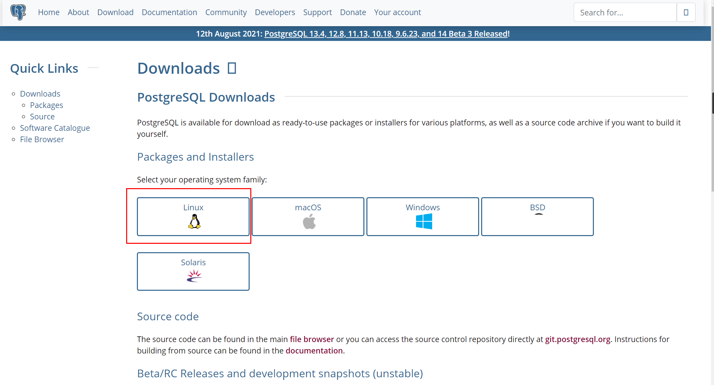

# 【安装部署】PostgreSQL 编译安装

本人主要是postgresql编译安装和测试，包括非postgres如何进行编译安装和root用户安装的测试。

### Table of Contents

- [1 安装环境](https://www.modb.pro/db/99731#1__2)

- - [1.1 操作系统](https://www.modb.pro/db/99731#11__4)
  - [1.2 PG软件下载](https://www.modb.pro/db/99731#12_PG_15)
  - 

- [2 安装准备](https://www.modb.pro/db/99731#2__51)

- - [2.1 关闭防火墙](https://www.modb.pro/db/99731#21__55)
  - [2.2 关闭selinux](https://www.modb.pro/db/99731#22_selinux_64)
  - [2.3 创建安装目录](https://www.modb.pro/db/99731#23__75)
  - [2.4 配置资源限制](https://www.modb.pro/db/99731#24__85)
  - [2.5 remove IPC](https://www.modb.pro/db/99731#25_remove_IPC_108)
  - [2.6 文件系统优化-可选](https://www.modb.pro/db/99731#26__122)
  - [2.7 配置YUM](https://www.modb.pro/db/99731#27_YUM_136)

- [3 编译安装](https://www.modb.pro/db/99731#3__180)

- - [3.1 创建用户](https://www.modb.pro/db/99731#31__184)

  - [3.2 解压缩](https://www.modb.pro/db/99731#32__195)

  - [3.3 安装必要的包](https://www.modb.pro/db/99731#33__206)

  - [3.4 编译安装](https://www.modb.pro/db/99731#34__229)

  - - [3.4.1 简易安装](https://www.modb.pro/db/99731#341__233)
    - [3.4.2 configure](https://www.modb.pro/db/99731#342_configure_253)
    - [2.4.3 make&make install](https://www.modb.pro/db/99731#243_makemake_install_493)
    - [3.4.4 初始化集簇](https://www.modb.pro/db/99731#344__515)
    - [3.4.5 启动数据库](https://www.modb.pro/db/99731#345__557)

- [4 后续配置](https://www.modb.pro/db/99731#4__585)

- - [4.1 用户环境变量设置](https://www.modb.pro/db/99731#41__587)
  - [4.2 配置参数](https://www.modb.pro/db/99731#42__679)
  - [4.3 配置pg_hba](https://www.modb.pro/db/99731#43_pg_hba_703)
  - [4.4 简单测试命令](https://www.modb.pro/db/99731#44__730)
  - [4.5 配置service](https://www.modb.pro/db/99731#45_service_898)
  - [4.6 PGADMIN工具连接测试](https://www.modb.pro/db/99731#46_PGADMIN_1042)

- [5 非 postgres 普通用户安装测试](https://www.modb.pro/db/99731#5__postgres__1050)

- - [5.1 创建普通用户](https://www.modb.pro/db/99731#51__1054)
  - [5.2 拷贝安装包](https://www.modb.pro/db/99731#52__1065)
  - [5.3 解压缩](https://www.modb.pro/db/99731#53__1076)
  - [5.4 编译安装](https://www.modb.pro/db/99731#54__1085)
  - [5.5 初始化](https://www.modb.pro/db/99731#55__1122)
  - [5.7 测试连接](https://www.modb.pro/db/99731#57__1166)
  - [5.8 总结](https://www.modb.pro/db/99731#58__1203)

- [6 root编译安装测试](https://www.modb.pro/db/99731#6_root_1209)

- - [6.1 编译安装方式](https://www.modb.pro/db/99731#61__1213)
  - [6.2 rpm安装方式](https://www.modb.pro/db/99731#62__rpm_1262)

- [7 删除默认安装的postgresql](https://www.modb.pro/db/99731#7_postgresql_1361)

# 1 安装环境

## 1.1 操作系统

```
[root@pgserver12 ~]# more /etc/redhat-release
CentOS Linux release 7.6.1810 (Core)
[root@pgserver12 ~]#
```

## 1.2 PG软件下载

 PostgreSQL 12.5 源代码可以从我们的官方网站 https://www.postgresql.org/download/的下载区中获得




如果采用yum方式进行安装，可以使用如下代码：


## 

同时RPM方式包说明如下：

| postgresql-client  | libraries and client binaries                    |
| ------------------ | ------------------------------------------------ |
| postgresql-server  | core database server                             |
| postgresql-contrib | additional supplied modules                      |
| postgresql-devel   | libraries and headers for C language development |


源代码下载方式如下：（这里下载的12.5，主要为了后期实验升级到12.8的测试）


# 2 安装准备

## 2.1 关闭防火墙

```
systemctl stop firewalld
systemctl disable firewalld
```

## 2.2 关闭selinux

```
--关闭Selinux
sed -i "s/SELINUX=enforcing/SELINUX=disabled/g" /etc/selinux/config
cat /etc/selinux/config
setenforce 0
```

## 2.3 创建安装目录

```
/data/pg12.5/pgdata   --数据库目录(PGDATA)
/data/pg12.5   --软件目录（PGHOME）
mkdir -p /data/pg12.5/pgdata 
```

## 2.4 配置资源限制

```
cat >> /etc/security/limits.conf <<EOF
# nofile超过1048576的话，一定要先将sysctl的fs.nr_open设置为更大的值，并生效后才能继续设置nofile.

* soft nofile  1024000 # The maximum number of open file descriptors
* hard nofile  1024000
* soft nproc   unlimited # The maximum number of processes available to a single user
* hard nproc   unlimited 
* soft memlock unlimited # The maximum size that may be locked into memory
* hard memlock unlimited
* soft core    unlimited # The maximum size of core files created
* hard core    unlimited
* soft stack   unlimited  
* hard stack   unlimited 
EOF

最好在关注一下/etc/security/limits.d目录中的文件内容，会覆盖limits.conf的配置。
```

## 2.5 remove IPC

```
-- remove IPC
/etc/systemd/logind.conf
RemoveIPC=no
service systemd-logind restart
```

## 2.6 文件系统优化-可选

```
xfs
# vi /etc/fstab
/dev/sdd1 /data nodev,discard,noatime,inode64,allocsize=16m,errors=remount-ro 0 0

ext4
# vi /etc/fstab
/dev/sdd1 /data defaults,noatime,nodiratime,nodelalloc,barrier=0 0 0
```

## 2.7 配置YUM

```
--配置yum 仓库
rm -rf /etc/yum.repos.d/CentOS*
#配置本地源和网络源
cat >/etc/yum.repos.d/local.repo<<EOF
[local]
name=local
baseurl=file:///mnt
enabled=1
gpgcheck=0
EOF

#配置网络源
cat >/etc/yum.repos.d/huawei.repo<<EOF
[huaweirepo]
name=huawei
baseurl=https://mirrors.huaweicloud.com/centos/7.9.2009/os/x86_64/
enabled=1
gpgcheck=0
EOF

cat >/etc/yum.repos.d/huaweiepel.repo<<EOF
[huaweiepel]
name=epel
baseurl=https://mirrors.huaweicloud.com/epel/7Server/x86_64/
enabled=1
gpgcheck=0
EOF
--挂载本地镜像
mount /dev/cdrom /mnt
--重新启动系统
--YUM 安装软件包
# yum install -y centos-release-scl;
wget -P /etc/yum.repos.d/ http://mirrors.aliyun.com/repo/epel-7.repo;
yum clean all 
yum makecache 
```

# 3 编译安装

## 3.1 创建用户

```
useradd -u 2000 postgres
echo postgres | passwd --stdin postgres
chown postgres:postgres -R /data/
```

## 3.2 解压缩

```
	--给安装包授权
chown postgres.postgres postgresql-12.5.tar.gz
[root@pgserver12 ~]# mv postgresql-12.5.tar.gz  /home/postgres
tar -zxf postgresql-12.5.tar.gz
```

## 3.3 安装必要的包

```
	--执行依赖包
yum install -y libicu-devel.x86_64 \
libicu.x86_64 \
perl-ExtUtils-Embed.noarch \
readline \
readline-devel \
zlib-devel \
cryptopp-devel.x86_64 \
openssl-devel \
pam-devel \
libxml2-devel \
libxslt-devel \
openldap-devel \
systemd-devel \
tcl-devel \
python-devel \
```

## 3.4 编译安装

### 3.4.1 简易安装

```
  官方简单版本的安装
./configure
make
su
make install
adduser postgres
mkdir /usr/local/pgsql/data
chown postgres /usr/local/pgsql/data
su - postgres
/usr/local/pgsql/bin/initdb -D /usr/local/pgsql/data
/usr/local/pgsql/bin/pg_ctl -D /usr/local/pgsql/data -l logfile start
/usr/local/pgsql/bin/createdb test
/usr/local/pgsql/bin/psql test
```

### 3.4.2 configure

```
--执行 ./configure 
./configure \
--prefix=/data/pg12.5/ \
--with-perl \
--with-python \
--with-tcl \
--with-tclconfig= \
--with-gssapi \
--with-icu \
--with-openssl \
--with-pam \
--with-ldap \
--with-systemd \
--with-readline \
--with-libxml \
--with-libxslt \
--with-segsize=1 \
--with-blocksize=8 \
--with-wal-blocksize=8 \
--with-zlib 
```

官方参考

```
你可以通过给出下面的configure命令行选项中的一个或更多的选项来自定义编译和安装过程： 

--prefix=PREFIX
把所有文件装在目录PREFIX中而不是/usr/local/pgsql中。 实际的文件会安装到数个子目录中；没有一个文件会直接安装到PREFIX目录里。 

如果你有特殊需要，你还可以用下面的选项自定义不同的子目录的位置。 不过，如果你把这些设置保留默认，那么安装将是可重定位的，意思是你可以在安装过后移动目录（man和doc位置不受此影响）。 

对于可重定位的安装，你可能需要使用configure的--disable-rpath选项。 还有，你需要告诉操作系统如何找到共享库。 

--exec-prefix=EXEC-PREFIX
你可以把体系相关的文件安装到一个不同的前缀下（EXEC-PREFIX），而不是PREFIX中设置的地方。 这样做可以比较方便地在不同主机之间共享体系相关的文件。 如果你省略这些，那么EXEC-PREFIX就会被设置为等于 PREFIX并且体系相关和体系无关的文件都会安装到同一棵目录树下，这也可能是你想要的。 

--bindir=DIRECTORY
为可执行程序指定目录。默认是EXEC-PREFIX/bin， 通常也就是/usr/local/pgsql/bin。 

--sysconfdir=DIRECTORY
用于各种各样配置文件的目录，默认为PREFIX/etc。 

--libdir=DIRECTORY
设置安装库和动态装载模块的目录。默认是EXEC-PREFIX/lib。 

--includedir=DIRECTORY
C 和 C++ 头文件的目录。默认是PREFIX/include。 

--datarootdir=DIRECTORY
设置多种只读数据文件的根目录。这只为后面的某些选项设置默认值。默认值为PREFIX/share。 

--datadir=DIRECTORY
设置被安装的程序使用的只读数据文件的目录。默认值为DATAROOTDIR。注意这不会对你的数据库文件被放置的位置产生任何影响。 

--localedir=DIRECTORY
设置安装区域数据的目录，特别是消息翻译目录文件。默认值为DATAROOTDIR/locale。 

--mandir=DIRECTORY
PostgreSQL自带的手册页将安装到这个目录，它们被安装在相应的manx子目录里。 默认是DATAROOTDIR/man。 

--docdir=DIRECTORY
设置安装文档文件的根目录，“man”页不包含在内。这只为后续选项设置默认值。这个选项的默认值为DATAROOTDIR/doc/postgresql。 

--htmldir=DIRECTORY
PostgreSQL的HTML格式的文档将被安装在这个目录中。默认值为DATAROOTDIR。 

--with-extra-version=STRING
把STRING追加到 PostgreSQL 版本号。例如，你可以使用它来标记从未发布的 Git 快照或者包含定制补丁（带有一个如git describe标识符之类的额外版本号或者一个分发包发行号）创建的二进制文件。 

--with-includes=DIRECTORIES
DIRECTORIES是一个冒号分隔的目录列表，这些目录将被加入编译器的头文件搜索列表中。 如果你有一些可选的包（例如 GNU Readline）安装在非标准位置， 你就必须使用这个选项，以及可能还有相应的 --with-libraries选项。 

例子：--with-includes=/opt/gnu/include:/usr/sup/include. 

--with-libraries=DIRECTORIES
DIRECTORIES是一个冒号分隔的目录列表，这些目录是用于查找库文件的。 如果你有一些包安装在非标准位置，你可能就需要使用这个选项（以及对应的--with-includes选项）。 

例子：--with-libraries=/opt/gnu/lib:/usr/sup/lib. 

--enable-nls[=LANGUAGES]
打开本地语言支持（NLS），也就是以非英文显示程序消息的能力。LANGUAGES是一个空格分隔的语言代码列表， 表示你想支持的语言。例如--enable-nls='de fr' （你提供的列表和实际支持的列表之间的交集将会自动计算出来）。如果你没有声明一个列表，那么就会安装所有可用的翻译。 

要使用这个选项，你需要一个Gettext API 的实现。见上文。 

--with-pgport=NUMBER
把NUMBER设置为服务器和客户端的默认端口。默认是 5432。 这个端口可以在以后修改，不过如果你在这里声明，那么服务器和客户端将有相同的编译好了的默认值。这样会非常方便些。 通常选取一个非默认值的理由是你企图在同一台机器上运行多个PostgreSQL服务器。 

--with-perl
制作PL/Perl服务器端编程语言。 

--with-python
制作PL/Python服务器端编程语言。 

--with-tcl
制作PL/Tcl服务器编程语言。 

--with-tclconfig=DIRECTORY
Tcl 安装文件tclConfig.sh，其中里面包含编译与 Tcl 接口的模块的配置信息。该文件通常可以自动地在一个众所周知的位置找到，但是如果你需要一个不同版本的 Tcl，你也可以指定可以找到它的目录。 

--with-gssapi
编译 GSSAPI 认证支持。在很多系统上，GSSAPI（通常是 Kerberos 安装的一部分）系统不会被安装在默认搜索位置（例如/usr/include、/usr/lib），因此你必须使用选项--with-includes和--with-libraries来配合该选项。configure将会检查所需的头文件和库以确保你的 GSSAPI 安装足以让配置继续下去。 

--with-krb-srvnam=NAME
默认的 Kerberos 服务主的名称（也被 GSSAPI 使用）。默认是postgres。通常没有理由改变这个值，除非你是一个 Windows 环境，这种情况下该名称必须被设置为大写形式POSTGRES。 

--with-llvm
支持基于LLVM的JIT编译 （请参阅第 31 章）。 这需要安装LLVM库。 当前LLVM的最低要求版本是3.9。 

llvm-config 可用于查找所需的编译选项。llvm-config会在PATH 上搜索所有受支持版本的llvm-config-$major-$minor。 如果那还不能找到正确的二进制文件，请使用LLVM_CONFIG指定正确的 llvm-config的路径。例如： 

./configure ... --with-llvm LLVM_CONFIG='/path/to/llvm/bin/llvm-config'

LLVM支持需要兼容的clang编译器 （必要时使用CLANG环境变量指定）和有效的C++编译器 （必要时使用使用CXX环境变量指定）。 

--with-icu
支持ICU库。 这需要安装ICU4C软件包。 目前要求的最低ICU4C版本是4.2。 

默认的，pkg-config 将被用来查找所需的编译选项。支持ICU4C版本4.6及更高版本。 对于较老版本，或者如果pkg-config不可用， 可以将变量ICU_CFLAGS和ICU_LIBS 指定为configure，就像下面的示例中那样： 

./configure ... --with-icu ICU_CFLAGS='-I/some/where/include' ICU_LIBS='-L/some/where/lib -licui18n -licuuc -licudata'
(如果ICU4C在编译器的默认搜索路径中， 那么你仍然需要指定一个非空的字符串，以避免使用pkg-config， 例如ICU_CFLAGS=' '。) 

--with-openssl 
编译SSL（加密）连接支持。这个选项需要安装OpenSSL包。configure将会检查所需的头文件和库以确保你的 OpenSSL安装足以让配置继续下去。 

--with-pam
编译PAM（可插拔认证模块）支持。 

--with-bsd-auth
编译 BSD 认证支持（BSD 认证框架目前只在 OpenBSD 上可用）。 

--with-ldap
为认证和连接参数查找编译LDAP支持 （详见第 33.17 节和第 20.10 节）。在 Unix 上，这需要安装OpenLDAP包。在 Windows 上将使用默认的WinLDAP库。configure将会检查所需的头文件和库以确保你的 OpenLDAP安装足以让配置继续下去。 

--with-systemd
编译对systemd 服务通知的支持。如果服务器是在systemd 机制下被启动，这可以提高集成度，否则不会有影响 否则，; 参考 第 18.3 节 查看更多信息 。要使用这个选项，必须安装libsystemd 以及相关的头文件。 

--without-readline
避免使用Readline库（以及libedit）。这个选项禁用了psql中的命令行编辑和历史， 因此我们不建议这么做。 

--with-libedit-preferred
更倾向于使用BSD许可证的libedit库而不是GPL许可证的Readline。这个选项只有在你同时安装了两个库时才有意义，在那种情况下默认会使用Readline。 

--with-bonjour
编译 Bonjour 支持。这要求你的操作系统支持 Bonjour。在 macOS 上建议使用。 

--with-uuid=LIBRARY
使用指定的 UUID 库编译uuid-ossp模块（提供生成 UUID 的函数）。 LIBRARY必须是下列之一： 

bsd，用来使用 FreeBSD、NetBSD 和一些其他 BSD 衍生系统 中的 UUID 函数 

e2fs，用来使用e2fsprogs项目创建的 UUID 库， 这个库出现在大部分的 Linux 系统和 macOS 中，并且也能找到用于其他平台的 版本 

ossp，用来使用OSSP UUID library 

--with-ossp-uuid
--with-uuid=ossp的已废弃的等效选项。 

--with-libxml
编译 libxml （启用 SQL/XML 支持）。这个特性需要 Libxml 版本 2.6.23 及以上。 

Libxml 会安装一个程序xml2-config，它可以被用来检测所需的编译器和链接器选项。如果能找到，PostgreSQL 将自动使用它。要制定一个非常用的 libxml 安装位置，你可以设置环境变量XML2_CONFIG指向xml2-config程序所属的安装，或者使用选项--with-includes和--with-libraries。 

--with-libxslt
编译xml2模块时使用 libxslt。xml2依赖这个库来执行XML的XSL转换。 

--disable-float4-byval
禁用 float4 值的“传值”，导致它们只能被“传引用”。这个选项会损失性能，但是在需要兼容使用 C 编写并使用“version 0”调用规范的老用户定义函数时可能需要这个选项。更好的长久解决方案是将任何这样的函数更新成使用“version 1”调用规范。 

--disable-float8-byval
禁用 float8 值的“传值”，导致它们只能被“传引用”。这个选项会损失性能，但是在需要兼容使用 C 编写并使用“version 0”调用规范的老用户定义函数时可能需要这个选项。更好的长久解决方案是将任何这样的函数更新成使用“version 1”调用规范。注意这个选项并非只影响 float8，它还影响 int8 和某些相关类型如时间戳。在32位平台上，--disable-float8-byval是默认选项并且不允许选择--enable-float8-byval。 

--with-segsize=SEGSIZE
设置段尺寸，以 G 字节计。大型的表会被分解成多个操作系统文件，每一个的尺寸等于段尺寸。这避免了与操作系统对文件大小限制相关的问题。默认的段尺寸（1G字节）在所有支持的平台上都是安全的。如果你的操作系统有“largefile”支持（如今大部分都支持），你可以使用一个更大的段尺寸。这可以有助于在使用非常大的表时消耗的文件描述符数目。但是要当心不能选择一个超过你将使用的平台和文件系统所支持尺寸的值。你可能希望使用的其他工具（如tar）也可以对可用文件尺寸设限。如非绝对必要，我们推荐这个值应为2的幂。注意改变这个值需要一次 initdb。 

--with-blocksize=BLOCKSIZE
设置块尺寸，以 K 字节计。这是表内存储和I/O的单位。默认值（8K字节）适合于大多数情况，但是在特殊情况下可能其他值更有用。这个值必须是2的幂并且在 1 和 32 （K字节）之间。注意修改这个值需要一次 initdb。 

--with-wal-blocksize=BLOCKSIZE
设置WAL 块尺寸，以 K 字节计。这是 WAL 日志存储和I/O的单位。默认值（8K 字节）适合于大多数情况，但是在特殊情况下其他值更好有用。这个值必须是2的幂并且在 1 到 64（K字节）之间。注意修改这个值需要一次 initdb。 

--disable-spinlocks
即便PostgreSQL对于该平台没有 CPU 自旋锁支持，也允许编译成功。自旋锁支持的缺乏会导致较差的性能，因此这个选项只有当编译终端或者通知你该平台缺乏自旋锁支持时才应被使用。如果在你的平台上要求使用该选项来编译PostgreSQL，请将此问题报告给PostgreSQL的开发者。 

--disable-thread-safety
禁用客户端库的线程安全性。这会阻止libpq和ECPG程序中的并发线程安全地控制它们私有的连接句柄。 

--with-system-tzdata=DIRECTORY 
PostgreSQL包含它自己的时区数据库，它被用于日期和时间操作。这个时区数据库实际上是和 IANA 时区数据库相兼容的，后者在很多操作系统如 FreeBSD、Linux和Solaris上都有提供，因此再次安装它可能是冗余的。当这个选项被使用时，将不会使用DIRECTORY中系统提供的时区数据库，而是使用包括在 PostgreSQL 源码发布中的时区数据库。DIRECTORY必须被指定为一个绝对路径。/usr/share/zoneinfo在某些操作系统上是一个很有可能的路径。注意安装例程将不会检测不匹配或错误的时区数据。如果你使用这个选项，建议你运行回归测试来验证你指定的时区数据能正常地工作在PostgreSQL中。 

这个选项主要针对那些很了解他们的目标操作系统的二进制包发布者。使用这个选项主要优点是不管何时当众多本地夏令时规则之一改变时， PostgreSQL 包不需要被升级。另一个优点是如果时区数据库文件在安装时不需要被编译， PostgreSQL 可以被更直接地交叉编译。 

--without-zlib
避免使用Zlib库。这样就禁用了pg_dump和 pg_restore中对压缩归档的支持。这个选项只适用于那些没有这个库的少见的系统。 

--enable-debug
把所有程序和库以带有调试符号的方式编译。这意味着你可以通过一个调试器运行程序来分析问题。 这样做显著增大了最后安装的可执行文件的大小，并且在非 GCC 的编译器上，这么做通常还要关闭编译器优化， 这些都导致速度的下降。但是，如果有这些符号的话，就可以非常有效地帮助定位可能发生问题的位置。目前，我们只是在你使用 GCC 的情况下才建议在生产安装中使用这个选项。但是如果你正在进行开发工作，或者正在使用 beta 版本，那么你就应该总是打开它。 

--enable-coverage
如果在使用 GCC，所有程序和库都会用代码覆盖率测试工具编译。在运行时，它们会在编译目录中生成代码覆盖率度量的文件。详见第 32.5 节。这个选项只用于 GCC 以及做开发工作时。 

--enable-profiling
如果在使用 GCC，所有程序和库都被编译成可以进行性能分析。在后端退出时，将会创建一个子目录，其中包含用于性能分析的gmon.out文件。这个选项只用于 GCC 和做开发工作时。 

--enable-cassert
打开在服务器中的assertion检查， 它会检查许多“不可能发生”的条件。它对于代码开发的用途而言是无价之宝， 不过这些测试可能会显著地降低服务器的速度。并且，打开这个测试不会提高你的系统的稳定性！ 这些断言检查并不是按照严重性分类的，因此一些相对无害的小故障也可能导致服务器重启 — 只要它触发了一次断言失败。 目前，我们不推荐在生产环境中使用这个选项，但是如果你在做开发或者在使用 beta 版本的时候应该打开它。 

--enable-depend
打开自动倚赖性跟踪。如果打开这个选项，那么制作文件（makefile）将设置为在任何头文件被修改的时候都将重新编译所有受影响的目标文件。 如果你在做开发的工作，那么这个选项很有用，但是如果你只是想编译一次并且安装，那么这就是浪费时间。 目前，这个选项只对 GCC 有用。 

--enable-dtrace
为PostgreSQL编译对动态跟踪工具 DTrace 的支持。 详见第 27.5 节。 

要指向dtrace程序，必须设置环境变量DTRACE。这通常是必需的，因为dtrace通常被安装在/usr/sbin中，该路径可能不在搜索路径中。 

dtrace程序的附加命令行选项可以在环境变量DTRACEFLAGS中指定。在 Solaris 上，要在一个64位二进制中包括 DTrace，你必须为 configure 指定DTRACEFLAGS="-64"。例如，使用 GCC 编译器： 

./configure CC='gcc -m64' --enable-dtrace DTRACEFLAGS='-64' ...
使用 Sun 的编译器： 

./configure CC='/opt/SUNWspro/bin/cc -xtarget=native64' --enable-dtrace DTRACEFLAGS='-64' ...

--enable-tap-tests
启用 Perl TAP 工具进行测试。这要求安装了 Perl 以及 Perl 模块IPC::Run。
```

### 2.4.3 make&make install

```
--执行编译
	make world -j2
	
	
make[2]: Leaving directory `/home/postgres/postgresql-12.5/contrib/jsonb_plpython'
make[1]: Leaving directory `/home/postgres/postgresql-12.5/contrib'
PostgreSQL, contrib, and documentation successfully made. Ready to install.

--执行编译安装
	make install-world -j2    （word是生成相关文档）
	
make[2]: Leaving directory `/home/postgres/postgresql-12.5/contrib/ltree_plpython'
make[1]: Leaving directory `/home/postgres/postgresql-12.5/contrib'
PostgreSQL, contrib, and documentation installation complete.
```

### 3.4.4 初始化集簇

```
--初始化数据库集簇

[postgres@pgserver12 bin]$ pwd
/data/pg12.5/bin

./initdb -D /data/pg12.5/pgdata
[postgres@pgserver12 bin]$ ./initdb -D /data/pg12.5/pgdata
The files belonging to this database system will be owned by user "postgres".
This user must also own the server process.

The database cluster will be initialized with locale "en_US.UTF-8".
The default database encoding has accordingly been set to "UTF8".
The default text search configuration will be set to "english".

Data page checksums are disabled.

fixing permissions on existing directory /data/pg12.5/pgdata ... ok
creating subdirectories ... ok
selecting dynamic shared memory implementation ... posix
selecting default max_connections ... 100
selecting default shared_buffers ... 128MB
selecting default time zone ... PRC
creating configuration files ... ok
running bootstrap script ... ok
performing post-bootstrap initialization ... ok
syncing data to disk ... ok

initdb: warning: enabling "trust" authentication for local connections
You can change this by editing pg_hba.conf or using the option -A, or
--auth-local and --auth-host, the next time you run initdb.

Success. You can now start the database server using:

    ./pg_ctl -D /data/pg12.5/pgdata -l logfile start
```

### 3.4.5 启动数据库

```
--启动数据库
	[postgres@pgserver12 bin]$ ./pg_ctl  start -D /data/pg12.5/pgdata -l /tmp/logfile
	waiting for server to start.... done
	server started
	

[postgres@pgserver12 bin]$ ./pg_ctl  start -D /data/pg12.5/pgdata -l /tmp/logfile
waiting for server to start.... done
server started
[postgres@pgserver12 bin]$ psql
psql (12.5)
Type "help" for help.

postgres@[local]:5432=#select version();
                                                 version
---------------------------------------------------------------------------------------------------------
 PostgreSQL 12.5 on x86_64-pc-linux-gnu, compiled by gcc (GCC) 4.8.5 20150623 (Red Hat 4.8.5-44), 64-bit
(1 row)

postgres@[local]:5432=#
```

# 4 后续配置

## 4.1 用户环境变量设置

```
PGHOME:数据库软件的安装位置
echo "export PGHOME=/data/pg12.5" >>~/.bashrc
echo "export PGDATA=\${PGHOME}/pgdata" >>~/.bashrc
echo "export PATH=\${PGHOME}/bin:\$PATH" >>~/.bashrc
echo "export LD_LIBRARY_PATH=\${PGHOME}/lib:\$LD_LIBRARY_PATH" >>~/.bashrc


[postgres@pgserver12 ~]$ cat .bashrc
# .bashrc

# Source global definitions
if [ -f /etc/bashrc ]; then
        . /etc/bashrc
fi

# Uncomment the following line if you don't like systemctl's auto-paging feature:
# export SYSTEMD_PAGER=

# User specific aliases and functions
export PGHOME=/data/pg12.5
export PGDATA=${PGHOME}/pgdata
export PATH=${PGHOME}/bin:$PATH
export LD_LIBRARY_PATH=${PGHOME}/lib:$LD_LIBRARY_PATH
[postgres@pgserver12 ~]$


--重新读取环境变量
. ~/.bashrc
source ~/.bashrc
exit
su - postgres

	--常用变量配置--官方文档33.14. 环境变量
PGHOST的行为和host连接参数相同。 

PGHOSTADDR的行为和hostaddr连接参数相同。可以设置它来替代或者作为PGHOST的补充来防止 DNS 查找负担。 

PGPORT的行为和port连接参数相同。 

PGDATABASE的行为和dbname连接参数相同。 

PGUSER的行为和user连接参数相同。 

PGPASSWORD的行为和password连接参数相同。出于安全原因，我们不推荐使用这个环境变量，因为某些操作系统允许非根用户通过ps看到进程的环境变量。可以考虑使用一个口令文件（见第 33.15 节）。 

PGPASSFILE的行为和passfile连接参数相同。 

PGSERVICE的行为和service连接参数相同。 

PGSERVICEFILE指定针对每个用户的连接服务文件名。如果没有设置，默认为~/.pg_service.conf（见第 33.16 节）。 

PGOPTIONS的行为和options连接参数相同。 

PGAPPNAME的行为和application_name连接参数相同。 

PGSSLMODE的行为和sslmode连接参数相同。 

PGREQUIRESSL的行为和requiressl连接参数相同。为了支持PGSSLMODE变量，这个环境变量已被废弃。同时设置两个变量会抑制这一个的效果。 

PGSSLCOMPRESSION的行为和sslcompression连接参数相同。 

PGSSLCERT的行为和sslcert连接参数相同。 

PGSSLKEY的行为和sslkey连接参数相同。 

PGSSLROOTCERT的行为和sslrootcert连接参数相同。 

PGSSLCRL的行为和sslcrl连接参数相同。 

PGREQUIREPEER的行为和requirepeer连接参数相同。 

PGGSSENCMODE 的行为和 gssencmode连接参数相同。 

PGKRBSRVNAME的行为和krbsrvname连接参数相同。 

PGGSSLIB的行为和gsslib连接参数相同。 

PGCONNECT_TIMEOUT的行为和connect_timeout连接参数相同。 

PGCLIENTENCODING的行为和client_encoding连接参数相同。 

PGTARGETSESSIONATTRS的行为和target_session_attrs连接参数相同。 
```

## 4.2 配置参数

```
允许远程访问数据库。
	vi /data/pg12.5/pgdata/postgresql.conf
	# - Connection Settings -

	listen_addresses = '*'                  # what IP address(es) to listen on;
	                                    # comma-separated list of addresses;
	                                    # defaults to 'localhost'; use '*' for all
	                                    # (change requires restart)
	port = 5432                             # (change requires restart)

[postgres@pgserver12 ~]$ pg_ctl restart -D /data/pg12.5/pgdata/ -l /tmp/logfile
waiting for server to shut down.... done
server stopped
waiting for server to start.... done
server started
[postgres@pgserver12 ~]$
```

## 4.3 配置pg_hba

```
vi /data/pg12.5/pgdata/pg_hba.conf
......
# TYPE  DATABASE        USER            ADDRESS                 METHOD
 
# "local" is for Unix domain socket connections only
local   all             all                                     md5
# IPv4 local connections:
host    all             all             127.0.0.1/32            md5
# IPv6 local connections:
host    all             all             ::1/128                 md5
# Allow replication connections from localhost, by a user with the
# replication privilege.
#local   replication     all                                     peer
#host    replication     all             127.0.0.1/32            ident
#host    replication     all             ::1/128                 ident
host    all              all             192.168.0.0/16            md5

[postgres@pgserver12 ~]$ pg_ctl reload -D $PGDATA
server signaled
```

## 4.4 简单测试命令

```
[postgres@pgserver12 ~]$ psql -h 192.168.245.119 -p 5432 -d postgres
Password for user postgres:
psql: error: FATAL:  password authentication failed for user "postgres"

修改postgres密码

postgres@[local]:5432=#alter role postgres with password 'postgres';
ALTER ROLE
postgres@[local]:5432=#\q
[postgres@pgserver12 ~]$ psql -h 192.168.245.119 -p 5432 -d postgres
Password for user postgres:
psql (12.5)
Type "help" for help.

postgres@192.168.245.119:5432=#
postgres@192.168.245.119:5432=#\?
General
  \copyright             show PostgreSQL usage and distribution terms
  \crosstabview [COLUMNS] execute query and display results in crosstab
  \errverbose            show most recent error message at maximum verbosity
  \g [FILE] or ;         execute query (and send results to file or |pipe)
  \gdesc                 describe result of query, without executing it
  \gexec                 execute query, then execute each value in its result
  \gset [PREFIX]         execute query and store results in psql variables
  \gx [FILE]             as \g, but forces expanded output mode
  \q                     quit psql
  \watch [SEC]           execute query every SEC seconds

Help
  \? [commands]          show help on backslash commands
  \? options             show help on psql command-line options
  \? variables           show help on special variables
  \h [NAME]              help on syntax of SQL commands, * for all commands

Query Buffer
  \e [FILE] [LINE]       edit the query buffer (or file) with external editor
  \ef [FUNCNAME [LINE]]  edit function definition with external editor
  \ev [VIEWNAME [LINE]]  edit view definition with external editor
  \p                     show the contents of the query buffer
  \r                     reset (clear) the query buffer
  \s [FILE]              display history or save it to file
  \w FILE                write query buffer to file

Input/Output
  \copy ...              perform SQL COPY with data stream to the client host
  \echo [STRING]         write string to standard output
  \i FILE                execute commands from file
  \ir FILE               as \i, but relative to location of current script
  \o [FILE]              send all query results to file or |pipe
  \qecho [STRING]        write string to query output stream (see \o)

Conditional
  \if EXPR               begin conditional block
  \elif EXPR             alternative within current conditional block
  \else                  final alternative within current conditional block
  \endif                 end conditional block

Informational
  (options: S = show system objects, + = additional detail)
  \d[S+]                 list tables, views, and sequences
  \d[S+]  NAME           describe table, view, sequence, or index
  \da[S]  [PATTERN]      list aggregates
  \dA[+]  [PATTERN]      list access methods
  \db[+]  [PATTERN]      list tablespaces
  \dc[S+] [PATTERN]      list conversions
  \dC[+]  [PATTERN]      list casts
  \dd[S]  [PATTERN]      show object descriptions not displayed elsewhere
  \dD[S+] [PATTERN]      list domains
  \ddp    [PATTERN]      list default privileges
  \dE[S+] [PATTERN]      list foreign tables
  \det[+] [PATTERN]      list foreign tables
  \des[+] [PATTERN]      list foreign servers
  \deu[+] [PATTERN]      list user mappings
  \dew[+] [PATTERN]      list foreign-data wrappers
  \df[anptw][S+] [PATRN] list [only agg/normal/procedures/trigger/window] functions
  \dF[+]  [PATTERN]      list text search configurations
  \dFd[+] [PATTERN]      list text search dictionaries
  \dFp[+] [PATTERN]      list text search parsers
  \dFt[+] [PATTERN]      list text search templates
  \dg[S+] [PATTERN]      list roles
  \di[S+] [PATTERN]      list indexes
  \dl                    list large objects, same as \lo_list
  \dL[S+] [PATTERN]      list procedural languages
  \dm[S+] [PATTERN]      list materialized views
  \dn[S+] [PATTERN]      list schemas
  \do[S]  [PATTERN]      list operators
  \dO[S+] [PATTERN]      list collations
  \dp     [PATTERN]      list table, view, and sequence access privileges
  \dP[itn+] [PATTERN]    list [only index/table] partitioned relations [n=nested]
  \drds [PATRN1 [PATRN2]] list per-database role settings
  \dRp[+] [PATTERN]      list replication publications
  \dRs[+] [PATTERN]      list replication subscriptions
  \ds[S+] [PATTERN]      list sequences
  \dt[S+] [PATTERN]      list tables
  \dT[S+] [PATTERN]      list data types
  \du[S+] [PATTERN]      list roles
  \dv[S+] [PATTERN]      list views
  \dx[+]  [PATTERN]      list extensions
  \dy     [PATTERN]      list event triggers
  \l[+]   [PATTERN]      list databases
  \sf[+]  FUNCNAME       show a function's definition
  \sv[+]  VIEWNAME       show a view's definition
  \z      [PATTERN]      same as \dp

Formatting
  \a                     toggle between unaligned and aligned output mode
  \C [STRING]            set table title, or unset if none
  \f [STRING]            show or set field separator for unaligned query output
  \H                     toggle HTML output mode (currently off)
  \pset [NAME [VALUE]]   set table output option
                         (border|columns|csv_fieldsep|expanded|fieldsep|
                         fieldsep_zero|footer|format|linestyle|null|
                         numericlocale|pager|pager_min_lines|recordsep|
                         recordsep_zero|tableattr|title|tuples_only|
                         unicode_border_linestyle|unicode_column_linestyle|
                         unicode_header_linestyle)
  \t [on|off]            show only rows (currently off)
  \T [STRING]            set HTML <table> tag attributes, or unset if none
  \x [on|off|auto]       toggle expanded output (currently off)

Connection
  \c[onnect] {[DBNAME|- USER|- HOST|- PORT|-] | conninfo}
                         connect to new database (currently "postgres")
  \conninfo              display information about current connection
  \encoding [ENCODING]   show or set client encoding
  \password [USERNAME]   securely change the password for a user

Operating System
  \cd [DIR]              change the current working directory
  \setenv NAME [VALUE]   set or unset environment variable
  \timing [on|off]       toggle timing of commands (currently off)
  \! [COMMAND]           execute command in shell or start interactive shell

Variables
  \prompt [TEXT] NAME    prompt user to set internal variable
  \set [NAME [VALUE]]    set internal variable, or list all if no parameters
  \unset NAME            unset (delete) internal variable

Large Objects
  \lo_export LOBOID FILE
  \lo_import FILE [COMMENT]
  \lo_list
  \lo_unlink LOBOID      large object operations


postgres@[local]:5432=#\l
                                  List of databases
   Name    |  Owner   | Encoding |   Collate   |    Ctype    |   Access privileges
-----------+----------+----------+-------------+-------------+-----------------------
 postgres  | postgres | UTF8     | en_US.UTF-8 | en_US.UTF-8 |
 template0 | postgres | UTF8     | en_US.UTF-8 | en_US.UTF-8 | =c/postgres          +
           |          |          |             |             | postgres=CTc/postgres
 template1 | postgres | UTF8     | en_US.UTF-8 | en_US.UTF-8 | =c/postgres          +
           |          |          |             |             | postgres=CTc/postgres
(3 rows)

postgres@[local]:5432=#

无论任何用户安装 Postgresql,都可以安装成功，但是安装的数据库永远只有三个。
```

## 4.5 配置service

```
--使用普通用户安装的数据库，如何配置系统服务
cat >/usr/lib/systemd/system/postgresql12.service<<EOF
[Unit]
Description=PostgreSQL Database Server
[Service]
Type=forking
User=postgres
ExecStart=/data/pg12.5/bin/pg_ctl start -D /data/pg12.5/pgdata -l /tmp/logfile
ExecReload=/data/pg12.5/bin/pg_ctl reload -D /data/pg12.5/pgdata
ExecStop=/data/pg12.5/bin/pg_ctl stop -D /data/pg12.5/pgdata -l /tmp/logfile
ExecRestart=/data/pg12.t/bin/pg_ctl restart -D /data/pg12.5/pgdata -l /tmp/logfile
KillMode=mixed
KillSignal=SIGINT
TimeoutSec=0
[Install]
WantedBy=multi-user.target	
EOF

[root@pgserver12 yum.repos.d]# cat >/usr/lib/systemd/system/postgresql12.service<<EOF
> [Unit]
> Description=PostgreSQL Database Server
> [Service]
> Type=forking
> User=postgres
> ExecStart=/data/pg12.5/bin/pg_ctl start -D /data/pg12.5/pgdata -l /tmp/logfile
> ExecReload=/data/pg12.5/bin/pg_ctl reload -D /data/pg12.5/pgdata
> ExecStop=/data/pg12.5/bin/pg_ctl stop -D /data/pg12.5/pgdata -l /tmp/logfile
> ExecRestart=/data/pg12.t/bin/pg_ctl restart -D /data/pg12.5/pgdata -l /tmp/logfile
> KillMode=mixed
> KillSignal=SIGINT
> TimeoutSec=0
> [Install]
> WantedBy=multi-user.target
> EOF
[root@pgserver12 yum.repos.d]# cat /usr/lib/systemd/system/postgresql12.service
[Unit]
Description=PostgreSQL Database Server
[Service]
Type=forking
User=postgres
ExecStart=/data/pg12.5/bin/pg_ctl start -D /data/pg12.5/pgdata -l /tmp/logfile
ExecReload=/data/pg12.5/bin/pg_ctl reload -D /data/pg12.5/pgdata
ExecStop=/data/pg12.5/bin/pg_ctl stop -D /data/pg12.5/pgdata -l /tmp/logfile
ExecRestart=/data/pg12.t/bin/pg_ctl restart -D /data/pg12.5/pgdata -l /tmp/logfile
KillMode=mixed
KillSignal=SIGINT
TimeoutSec=0
[Install]
WantedBy=multi-user.target
[root@pgserver12 yum.repos.d]#

--执行系统服务项加载
systemctl daemon-reload
--使用 root 启动 postgresql12服务项
systemctl start postgresql12
--停止
systemctl stop postgresql12
--重新加载 
systemctl reload postgresql12
--重启 
systemctl restart postgresql12
--enable
systemctl enable postgresql12


[root@pgserver12 yum.repos.d]# systemctl start postgresql12
[root@pgserver12 yum.repos.d]# systemctl status postgresql12
● postgresql12.service - PostgreSQL Database Server
   Loaded: loaded (/usr/lib/systemd/system/postgresql12.service; disabled; vendor preset: disabled)
   Active: active (running) since Fri 2021-08-13 21:38:30 CST; 2s ago
  Process: 87987 ExecStart=/data/pg12.5/bin/pg_ctl start -D /data/pg12.5/pgdata -l /tmp/logfile (code=exited, status=0/SUCCESS)
 Main PID: 87989 (postgres)
   CGroup: /system.slice/postgresql12.service
           ├─87989 /data/pg12.5/bin/postgres -D /data/pg12.5/pgdata
           ├─87991 postgres: checkpointer
           ├─87992 postgres: background writer
           ├─87993 postgres: walwriter
           ├─87994 postgres: autovacuum launcher
           ├─87995 postgres: stats collector
           └─87996 postgres: logical replication launcher

Aug 13 21:38:30 pgserver12 systemd[1]: Starting PostgreSQL Database Server...
Aug 13 21:38:30 pgserver12 systemd[1]: Started PostgreSQL Database Server.
```

**service和pg_ctl的综合测试**

```
#使用 postgres用户启动的数据库是否能够被 systemctl终止掉？
  #先使用root停止系统服务
    # systemctl stop postgresql-13
    [root@pgserver12 yum.repos.d]# systemctl stop postgresql12
[root@pgserver12 yum.repos.d]#
[root@pgserver12 yum.repos.d]#
[root@pgserver12 yum.repos.d]#
[root@pgserver12 yum.repos.d]# systemctl status postgresql12
● postgresql12.service - PostgreSQL Database Server
   Loaded: loaded (/usr/lib/systemd/system/postgresql12.service; disabled; vendor preset: disabled)
   Active: inactive (dead)

Aug 13 21:37:21 pgserver12 systemd[1]: Failed to start PostgreSQL Database Server.
Aug 13 21:37:21 pgserver12 systemd[1]: Unit postgresql12.service entered failed state.
Aug 13 21:37:21 pgserver12 systemd[1]: postgresql12.service failed.
Aug 13 21:38:30 pgserver12 systemd[1]: Starting PostgreSQL Database Server...
Aug 13 21:38:30 pgserver12 systemd[1]: Started PostgreSQL Database Server.
Aug 13 21:45:25 pgserver12 systemd[1]: Stopping PostgreSQL Database Server...
Aug 13 21:45:25 pgserver12 systemd[1]: Stopped PostgreSQL Database Server.
Aug 13 21:45:25 pgserver12 systemd[1]: [/usr/lib/systemd/system/postgresql12.service:9] Unknown lvalue 'ExecRestart' in secti...ervice'
Aug 13 21:45:25 pgserver12 systemd[1]: [/usr/lib/systemd/system/postgresql12.service:9] Unknown lvalue 'ExecRestart' in secti...ervice'
Aug 13 21:45:28 pgserver12 systemd[1]: [/usr/lib/systemd/system/postgresql12.service:9] Unknown lvalue 'ExecRestart' in secti...ervice'
Hint: Some lines were ellipsized, use -l to show in full.


  #使用 postgres用户启动数据库
[postgres@pgserver12 ~]$ pg_ctl -D $PGDATA -l /tmp/logfile start
waiting for server to start.... done
server started
[postgres@pgserver12 ~]$


  #使用root用户尝试关闭数据库
 systemctl stop postgresql12
 
  #使用 postgres用户登录数据库验证
[postgres@pgserver12 ~]$ psql
psql (12.5)
Type "help" for help.

postgres@[local]:5432=#


结论：
使用 postgres用户启动的数据库，无法使用 systemctl stop postgresql12的命令停止
使用 systemctl start postgresql12命令启动的数据库服务器，可以通过 postgres用户进行停止。
```

## 4.6 PGADMIN工具连接测试


# 5 非 postgres 普通用户安装测试

本次测试普通非postgres用户是否可以安装和连接测试，安装和 postgres 用户安装一样，只不过不能使用 psql 直接登陆，需要指定数据库。

## 5.1 创建普通用户

```
useradd -u 2001 yanwei
echo postgres | passwd --stdin yanwei
mkdir -p /data1
chown yanwei:yanwei -R /data1/
```

## 5.2 拷贝安装包

```
cp /home/postgres/postgresql-12.5.tar.gz /home/yanwei
[root@pgserver12 ~]# cp /home/postgres/postgresql-12.5.tar.gz /home/yanwei
[root@pgserver12 ~]# chown yanwei:yanwei /home/yanwei/postgresql-12.5.tar.gz
```

## 5.3 解压缩

```
[yanwei@pgserver12 ~]$ tar -zxf postgresql-12.5.tar.gz
mkdir -p /data1/pg12.5
```

## 5.4 编译安装

```
--执行 ./configure 
./configure \
--prefix=/data1/pg12.5/ \
--with-pgport=6543 \
--with-perl \
--with-python \
--with-tcl \
--with-tclconfig= \
--with-gssapi \
--with-icu \
--with-openssl \
--with-pam \
--with-ldap \
--with-systemd \
--with-readline \
--with-libxml \
--with-libxslt \
--with-segsize=1 \
--with-blocksize=8 \
--with-wal-blocksize=8 \
--with-zlib 


--make
	make world -j2

--make install
    make install-world -j2 
    
  
```

## 5.5 初始化

```
./initdb -D /data1/pg12.5/pgdata
[yanwei@pgserver12 bin]$ ./initdb -D /data1/pg12.5/pgdata
The files belonging to this database system will be owned by user "yanwei".
This user must also own the server process.

The database cluster will be initialized with locale "en_US.UTF-8".
The default database encoding has accordingly been set to "UTF8".
The default text search configuration will be set to "english".

Data page checksums are disabled.

creating directory /data1/pg12.5/pgdata ... ok
creating subdirectories ... ok
selecting dynamic shared memory implementation ... posix
selecting default max_connections ... 100
selecting default shared_buffers ... 128MB
selecting default time zone ... PRC
creating configuration files ... ok
running bootstrap script ... ok
performing post-bootstrap initialization ... ok
syncing data to disk ... ok

initdb: warning: enabling "trust" authentication for local connections
You can change this by editing pg_hba.conf or using the option -A, or
--auth-local and --auth-host, the next time you run initdb.

Success. You can now start the database server using:

    ./pg_ctl -D /data1/pg12.5/pgdata -l logfile start

[yanwei@pgserver12 bin]$  ./pg_ctl -D /data1/pg12.5/pgdata -l logfile start
waiting for server to start.... done
server started
[yanwei@pgserver12 bin]$
```

## 5.7 测试连接

```
[yanwei@pgserver12 bin]$ ./psql
psql: error: FATAL:  database "yanwei" does not exist
[yanwei@pgserver12 bin]$
---不能直接psql连接，为什么？因为默认的没有yanwei的database

[yanwei@pgserver12 bin]$ ./psql -d postgres
psql (12.5)
Type "help" for help.

postgres=# create database yanwei;
CREATE DATABASE
postgres=# \q
[yanwei@pgserver12 bin]$ ./psql
psql (12.5)
Type "help" for help.

yanwei=# \l
                               List of databases
   Name    | Owner  | Encoding |   Collate   |    Ctype    | Access privileges
-----------+--------+----------+-------------+-------------+-------------------
 postgres  | yanwei | UTF8     | en_US.UTF-8 | en_US.UTF-8 |
 template0 | yanwei | UTF8     | en_US.UTF-8 | en_US.UTF-8 | =c/yanwei        +
           |        |          |             |             | yanwei=CTc/yanwei
 template1 | yanwei | UTF8     | en_US.UTF-8 | en_US.UTF-8 | =c/yanwei        +
           |        |          |             |             | yanwei=CTc/yanwei
 yanwei    | yanwei | UTF8     | en_US.UTF-8 | en_US.UTF-8 |
(4 rows)

yanwei=#
```

## 5.8 总结

安装和 postgres 用户安装一样，只不过不能使用 psql 直接登陆，需要指定数据库。或者创建同名的yanwei的database。

# 6 root编译安装测试

测试是否可以root安装和初始化呢

## 6.1 编译安装方式

```
[root@pgserver12 ~]# cp /home/postgres/postgresql-12.5.tar.gz /root
[root@pgserver12 ~]# cd /root
[root@pgserver12 ~]# ls
anaconda-ks.cfg                           postgresql12-contrib-12.5-1PGDG.rhel7.x86_64.rpm
postgresql12-12.5-1PGDG.rhel7.x86_64.rpm  postgresql12-libs-12.5-1PGDG.rhel7.x86_64.rpm
postgresql-12.5.tar.gz                    postgresql12-server-12.5-1PGDG.rhel7.x86_64.rpm
postgresql-12.8.tar.gz
[root@pgserver12 ~]# tar -zxf postgresql-12.5.tar.gz
[root@pgserver12 ~]# cd postgresql-12.5
[root@pgserver12 postgresql-12.5]# mkdir -p /data2/pg12.5
./configure \
--prefix=/data2/pg12.5/ \
--with-pgport=6543 \
--with-perl \
--with-python \
--with-tcl \
--with-tclconfig= \
--with-gssapi \
--with-icu \
--with-openssl \
--with-pam \
--with-ldap \
--with-systemd \
--with-readline \
--with-libxml \
--with-libxslt \
--with-segsize=1 \
--with-blocksize=8 \
--with-wal-blocksize=8 \
--with-zlib 

make -j2
make install j2

[root@pgserver12 bin]# ./initdb -D /data/pg12.5/pgdata
initdb: error: cannot be run as root
Please log in (using, e.g., "su") as the (unprivileged) user that will
own the server process.
[root@pgserver12 bin]#

无法进行初始化，说明root 编译安装方式是无法初始化数据库集簇的。这点大家要注意。
```

## 6.2 rpm安装方式

```
1.RPM安装
	[root@pgserver12 ~]# ls
	anaconda-ks.cfg                                   postgresql12-libs-12.5-1PGDG.rhel7.x86_64.rpm
	postgresql12-12.5-1PGDG.rhel7.x86_64.rpm          postgresql12-server-12.5-1PGDG.rhel7.x86_64.rpm
	postgresql12-contrib-12.5-1PGDG.rhel7.x86_64.rpm
	[root@pgserver12 ~]# rpm -ivh postgresql12-*.rpm
	warning: postgresql12-12.5-1PGDG.rhel7.x86_64.rpm: Header V4 DSA/SHA1 Signature, key ID 442df0f8: NOKEY
	Preparing...                          ################################# [100%]
	Updating / installing...
	1:postgresql12-libs-12.5-1PGDG.rhel################################# [ 25%]
	2:postgresql12-12.5-1PGDG.rhel7    ################################# [ 50%]
	3:postgresql12-server-12.5-1PGDG.rh################################# [ 75%]
	4:postgresql12-contrib-12.5-1PGDG.r################################# [100%]

	2、修改数据文件存放位置
	mkdir -p /data2/pgsql12/data/
	vi /usr/lib/systemd/system/postgresql-12.service
	例如修改如下
	# Location of database directory
	Environment=PGDATA=/data2/pgsql12/data/

	若这时进行初始化数据库/usr/pgsql-12/bin/postgresql-12-setup initdb会提示报错


	3、目录权限修改后再进行初始化数据库操作

	chown -R postgres.postgres /data2/pgsql12/data 
	chmod 755 /data2/pgsql12/data/
	rm -rf  /data2/pgsql12/data/*
	再进行初始化数据库操作
	/usr/pgsql-12/bin/postgresql-12-setup initdb


	4、设置服务开机自启动，并启动postgresql-12服务

	systemctl enable postgresql-12
	systemctl start postgresql-12


	5、修改数据库访问权限。
	vi /data2/pgsql12/data/pg_hba.conf
	......
	# TYPE  DATABASE        USER            ADDRESS                 METHOD
	 
	# "local" is for Unix domain socket connections only
	local   all             all                                     md5
	# IPv4 local connections:
	host    all             all             127.0.0.1/32            md5
	# IPv6 local connections:
	host    all             all             ::1/128                 md5
	# Allow replication connections from localhost, by a user with the
	# replication privilege.
	#local   replication     all                                     peer
	#host    replication     all             127.0.0.1/32            ident
	#host    replication     all             ::1/128                 ident
	host    all              all             0.0.0.0/0               md5

    
	6、允许远程访问数据库。
	vi /data/pgsql12/data/postgresql.conf
	# - Connection Settings -

	listen_addresses = '*'                  # what IP address(es) to listen on;
	                                    # comma-separated list of addresses;
	                                    # defaults to 'localhost'; use '*' for all
	                                    # (change requires restart)
	port = 5432                             # (change requires restart)

	测试连接pgadmin4

	systemctl restart postgresql-12

	7、测试

	# 创建数据库
		create database testdb;
	# 建立新的数据库用户
		create user yanwei with password 'yanwei';

	# 为新用户建立数据库
		alter database testdb owner to yanwei;

	# 把新建的数据库权限赋予新用户
		grant all privileges on database testdb to yanwei;
    
    alter role postgres with password 'postgres';
    psql -Upostgres -d postgres -h 192.168.245.119 -p 5432
    
    
```

RPM安装方式是可以root进行初始化，主要使用的是postgresql-12-setup

# 7 删除默认安装的postgresql

```
查询rpm -qa | grep postgresql
删除rpm -qa | grep postgresql | xargs rpm -e --nodeps
```